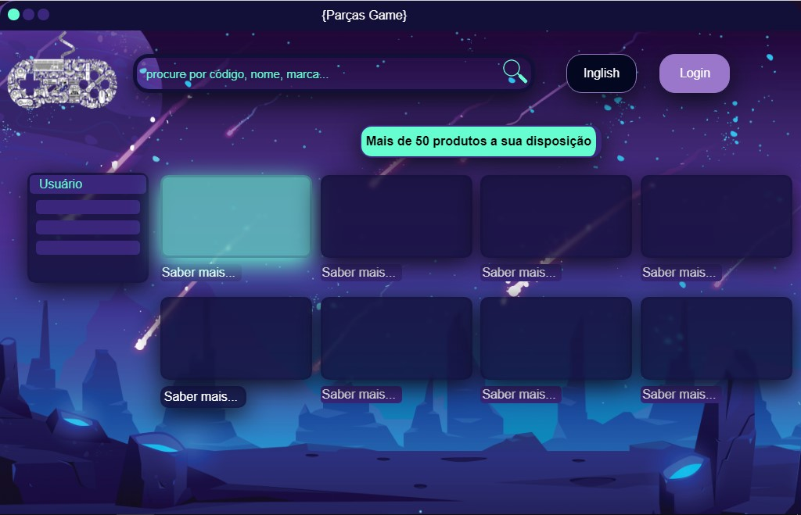
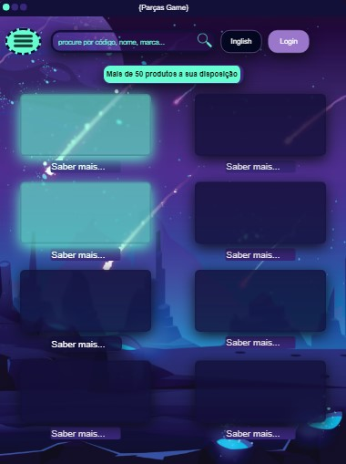
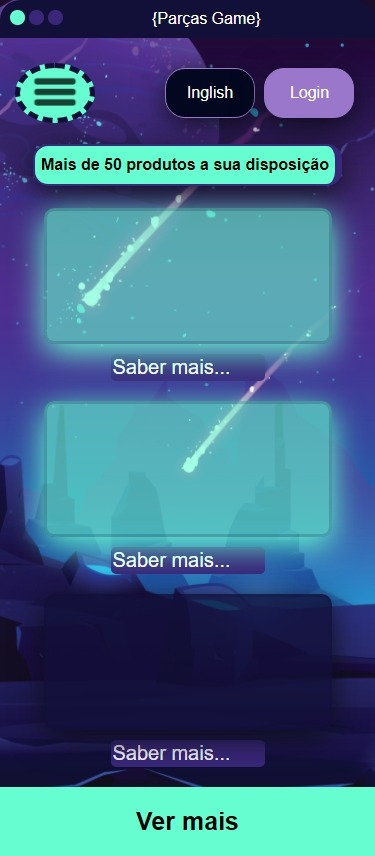

# **__Parças Developers School__**

## Desafio ui ux designer

Aqui nesse código apresento algumas funcionalidades de css e html voltada
a tecnologia de ux ui designer em modelo de exemplo em sua fase inicial.
No momento o projeto se apresenta responsivo para desktop de tela de largura 1200px
Ipad e Iphonex.
>
###**__Projeto para desktop__**
>

>
###**__Projeto do ipad__**
>

>
###**__Projeto do iphoneX__**
>

>
>
link projeto no jsfiddle:
>
https://jsfiddle.net/olavioch/sythoL6z/21/

